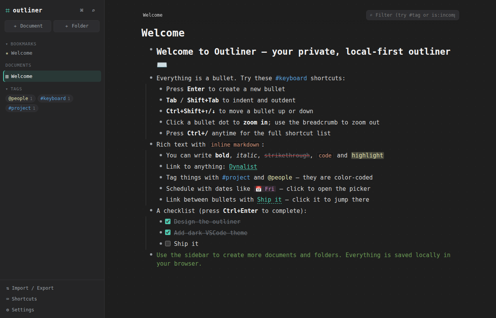

# ⌗ Outliner

A personal, **private, local‑first** outliner — a self‑hostable take on
[Dynalist](https://dynalist.io) Pro, wrapped in a dark **VSCode “Dark+” hacker**
theme with syntax‑token color coding.

Everything lives in your browser (IndexedDB). No account, no server, no
telemetry — your notes never leave the machine.



---

## Features

### Outlining core
- **Infinite nested bullets** with collapse / expand and indent guides
- **Keyboard‑first editing** — `Enter` splits at the cursor, `Tab` / `Shift+Tab`
  indent / outdent, `Ctrl/⌘+Shift+↑/↓` move bullets, arrow keys walk the tree
- **Zoom in** on any bullet (click its dot) with a breadcrumb trail to zoom back out
- **Drag & drop** bullets to reorder or re‑parent (before / after / into)
- **Notes** under any bullet (`Shift+Enter`)
- **Checkboxes / to‑dos** with completion + strikethrough (`Ctrl/⌘+Enter`)
- **Headings**, **color labels**, duplicate, cut / copy / paste of whole subtrees
- **Undo / redo** with sensible granularity

### Rich inline markdown (color‑coded like syntax tokens)
`**bold**` · `*italic*` · `~~strike~~` · `` `code` `` · `==highlight==` ·
`[label](url)` · `#tag` · `@mention` · `[[internal link]]` · `!(2026-07-10)` dates ·
`.word` (fuchsia) · standalone `-` / `*` markers (carmine)

- **#tags** and **@mentions** are clickable and collected into a tag pane
- **[[internal links]]** jump between bullets, with automatic **backlinks**
- **!(date)** tokens render as friendly labels (“Today”, “Tomorrow”, “Fri”),
  flag overdue items, and support **recurrence** (daily / weekly / monthly / yearly)
- **Per-word formatting** — select any word(s) inside a bullet and a floating
  toolbar (bold / italic / strike / code / highlight) applies to just that span

### Organize
- **Documents & folders** in a draggable sidebar
- **Bookmarks** for quick access
- **Search everything** (`Ctrl/⌘+K`) across all documents, with operators
  (`#tag`, `@mention`, `is:complete`, `is:incomplete`, `is:checkbox`,
  `has:date`, `-negation`, `"quoted phrases"`)
- **Filter within a document** (`Ctrl/⌘+F`)
- **Command palette** (`Ctrl/⌘+P`)

### Pro touches
- **Image & file attachments** — drag a file onto a bullet, paste an image, or
  use *Attach* in the context menu. Images render inline; other files become
  download chips. Stored locally as data URLs, so they stay private and survive
  reloads.
- **Import**: OPML, Markdown, plain text, JSON
- **Export**: OPML, Markdown, plain text, JSON (attachments included) — plus a
  full **backup** file
- **Custom CSS**, adjustable font size and accent color
- **Checkbox mode** & **numbered lists** per document

### Styling
- **Box a bullet** — give any bullet a border with a chosen color and stroke
  width (right-click → *Box border*)
- **Color labels** on bullets, **headings**, and per-document numbered lists

### Views & themes
- **Three themes** — Dark (VSCode “Dark+”), Darker (near-black), and Light
  (VSCode “Light+”) — switchable from the **View** menu
- **Layouts** (View → Layout) beyond the normal outline:
  - **2-column** — an independent 2nd column. Move a top-level block into it
    with the ▶ control; column-2 blocks live only here and are hidden in the
    other views. Choose **Fit width** (wrap) or **Scroll + zoom** (fixed-width
    columns that scroll horizontally, with a zoom slider).
  - **L ↔ R** — shift any block to the left or right of a central line while it
    keeps its row and its number in the list (great for two-sided / timeline
    notes). Toggling sides never interrupts editing.
- **View options** popover: show/hide completed items, show/hide notes, compact
  spacing, font size, and per-document settings
- **Collapsible sidebar** (`Ctrl/⌘+\`) for a distraction-free full-width outline

Press `Ctrl/⌘+/` in the app for the full shortcut reference.

---

## Run it

```bash
npm install
npm run dev      # open the printed http://localhost:5273
```

Build a static bundle you can host anywhere (or open locally):

```bash
npm run build
npm run preview
```

Requires Node 18+. The whole app is static — drop `dist/` on any static host,
or just keep running it locally.

---

## Privacy & data

- All documents are stored in **IndexedDB** in your browser, keyed to the app's
  origin (so it stays put across code updates as long as you open the same
  URL — the dev and preview servers are both pinned to `:5273`). Mirrored to
  `localStorage` as a safety net. Nothing is ever sent over the network.
- Auto‑saved (debounced) on every change. The app also requests **persistent
  storage** so the browser won't evict your data under disk pressure.
- **Connect a file (recommended for keeps):** *Settings → Data file → Save to a
  file…* lets you pick a real `outliner.json` on disk that the app auto‑saves to
  and remembers across reloads. Your notes then live in a folder you own and
  **survive clearing browser data entirely.** (Chrome/Edge desktop; other
  browsers fall back to IndexedDB.)
- Use **Import / Export → Download backup** for a portable JSON snapshot anytime,
  or **Settings → Erase all data** to start fresh.

> Browser storage alone is only as durable as your browser profile — clearing
> site data, a different browser/profile, or incognito will not see it. Connect a
> file, or keep backups, for anything you can't lose.

---

## Architecture

Plain **React + TypeScript + Vite**, ~zero runtime dependencies beyond React and
[Zustand](https://github.com/pmndrs/zustand) for state.

```
src/
  types.ts              Data model (normalized items + docs graph)
  store/
    store.ts            Zustand store — every outline operation, undo/redo, persistence
    selectors.ts        Derived views (tags, backlinks, doc-for-item)
    dragStore.ts        Ephemeral drag-and-drop state
  lib/
    tree.ts             Pure tree traversal / mutation helpers
    markdown.tsx        Inline markdown → React nodes (color-coded tokens)
    dates.ts            Date token parsing, labels, recurrence
    search.ts           Query parsing + item matching
    caret.ts            contentEditable caret helpers
    exporters.ts        OPML / Markdown / text / JSON export
    importers.ts        OPML / Markdown / text / JSON import
    persistence.ts      IndexedDB load/save (+ localStorage fallback)
    keymap.ts           Keyboard-shortcut reference
  components/           Sidebar, DocumentView, recursive OutlineNode, modals…
  styles/               VSCode-dark theme + layout
```

The item graph is fully **normalized** (`items[id]`, `docs[id]`); each document
owns a hidden root item whose children are its top‑level bullets. Bullets render
as pretty markdown when idle and switch to a raw `contentEditable` on focus.

---

## License

MIT — it’s yours. Make it your own via Settings → Custom CSS.
